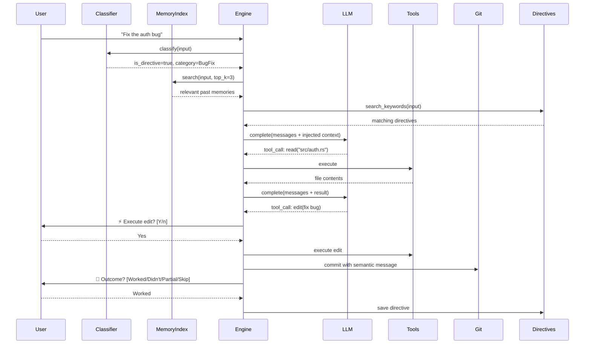

# 🔁 Loop

**A minimalist, Rust-native agent harness.**

Loop gives you a single binary that turns any LLM into a coding agent with filesystem access, tool execution, persistent memory, and git-aware version control — all from your terminal.

```
loop init      # one-time setup: pick models, add API keys
loop           # start the interactive REPL
loop run -p "fix the failing test in src/lib.rs"   # one-shot mode
loop manual    # full command reference
```

> 34 source files · ~6,600 lines of Rust · 7.3 MB release binary

---

## Why Loop?

Most agent harnesses are either heavyweight frameworks that take over your stack, or thin wrappers around a single provider's API. Loop is neither:

- **Provider-agnostic** — Switch between Claude, GPT-4o, Gemini, Llama (Groq), local Gemma (Ollama), and any OpenRouter model slug
- **Memory that persists** — Checkpoints, directives, and semantic search survive across sessions
- **Learns from your corrections** — When you tell it "no, do it this way," Loop records the directive and references it in future runs
- **Git-native** — Optionally commits every accepted change with an LLM-generated semantic commit message
- **MCP-enabled** — Connect to any Model Context Protocol server to extend the agent with external tools
- **Extensible** — Write plugins in any language, or let the agent write them for itself
- **Single binary** — No runtime, no daemon, no node_modules. Just `loop`.

---

## Getting Started

### Prerequisites

- **Rust** (1.70+): [rustup.rs](https://rustup.rs)
- At least one LLM API key (Anthropic, OpenAI, Google, Groq, or OpenRouter) — *or* [Ollama](https://ollama.com) for fully local operation
- Charm-style colors, badges, and rounded panels are built in with the Rust Lip Gloss port. Optional: [Gum](https://github.com/charmbracelet/gum) and [Glow](https://github.com/charmbracelet/glow) add an enhanced header and Markdown rendering (`brew install gum glow`).

### Install from Source

```bash
git clone https://github.com/yourname/loop-cli.git
cd loop-cli
cargo install --path .
```

This installs the `loop` binary to `~/.cargo/bin/`.

### First Run

```bash
loop init
```

The interactive wizard walks you through:

1. **Select providers** — multi-select from Anthropic, OpenAI, Gemini, Groq, Ollama, and OpenRouter
2. **Enter API keys** — masked input, encrypted in the operating system credential vault (macOS Keychain, Windows Credential Manager, or Linux Secret Service)
3. **Pick a default model** — the model used when you just type `loop`
4. **Add instruction files** — point to `.md` files with project-specific context
5. **Tool approval mode** — require confirmation before file writes (recommended)
6. **Git auto-commit** — opt in to automatic commits on accepted changes
7. **MCP servers** — connect to external tool servers (filesystem, GitHub, databases, etc.)

After setup, just type:

```bash
loop
```

You're now in the interactive REPL. Type what you want done, and Loop will read your files, plan an approach, make changes, and verify the results.

### Quick Examples

```
loop ▸ list the project structure and explain the architecture
loop ▸ fix the compilation error in src/parser.rs
loop ▸ add input validation to the create_user endpoint
loop ▸ review src/auth/ for security issues
loop ▸ refactor the parser and verify the patch -t2
```

---

## Capabilities

### 🤖 Six LLM Providers

| Provider | Models | How |
|:---|:---|:---|
| **Anthropic** | Claude Sonnet 4, Haiku 3.5 | API key |
| **OpenAI** | GPT-4o, GPT-4o-mini | API key |
| **Google Gemini** | Gemini 2.5 Pro, 2.5 Flash | API key |
| **Groq** | Llama 3.3 70B | API key |
| **Ollama** | Gemma 3 (local) | Local install, no API key needed |
| **OpenRouter** | Any supported provider/model slug | Verified OpenRouter API key |

All providers implement a unified trait. Switching models requires changing one line in `~/.loop/config.toml`.

During `loop init`, Loop verifies an OpenRouter key before asking for the full model slug, such as `anthropic/claude-sonnet-4` or `google/gemini-2.5-pro`.

API keys are never serialized to `config.toml`. Loop keeps provider/model metadata there with owner-only permissions and retrieves credentials into process memory only when needed. Existing plaintext keys are migrated to the operating system credential vault and removed from the TOML file on the next load.

### 🔧 Six Built-in Tools

| Tool | Type | Description |
|:---|:---|:---|
| `read` | 🔍 Read-only | Read file contents with optional line range |
| `write` | ⚡ Mutating | Create or overwrite files (auto-creates parent dirs) |
| `edit` | ⚡ Mutating | Surgical find-and-replace (exact string match) |
| `multi_edit` | ⚡ Mutating | Batch edits across multiple files in one atomic call |
| `bash` | ⚡ Mutating | Execute shell commands with timeout and output truncation |
| `list_dir` | 🔍 Read-only | Recursive directory listing with sizes |

Mutating tools require user approval by default. Disable with "YOLO mode" during `loop init`.

### 📌 Markdown Checkpoints

When you exit (`/quit`) or hit the iteration limit, Loop saves a checkpoint as a structured `.md` file:

```markdown
## ✅ DONE (completed — do NOT repeat)
- [x] Read src/main.rs and understood the CLI dispatch
- [x] Fixed the off-by-one error in pagination

## 🔄 DOING (context at suspension)
Was implementing the new validation layer. Had just written
the schema module and was about to wire it into the handler.

## 📋 NEXT (pending tasks — execute in order)
1. Wire validation into the create_user handler
2. Add tests for edge cases
3. Run the full test suite
```

On your next `loop` session, you're asked if you want to resume — the agent picks up exactly where it left off, knowing what's done, what's in progress, and what's next.

### 📋 Directives System

When you tell Loop something specific — *"no, use `HashMap` not `BTreeMap`"* or *"fix it by adding a null check before the dereference"* — Loop detects this as a **directive** and records:

- **Fingerprint**: a short identifier like `null-deref-auth-handler`
- **What you said**: the exact instruction
- **What was done**: the action taken
- **Outcome**: ✅ Worked / ❌ Didn't work / ⚠️ Partial

These are stored in `~/.loop/directives.md`. On every future run, Loop searches this file for relevant past directives and injects them into context. If something **didn't work before**, the agent is explicitly warned not to repeat it.

### 🧠 Semantic Memory Search

At startup, Loop builds a TF-IDF index over all saved memories:
- All directives (`~/.loop/directives.md`)
- All checkpoints (`~/.loop/checkpoints/*.md`)
- All skill files (`~/.loop/skills/*.md`)

Before each task, it performs cosine similarity search against the user's input and injects the top-3 relevant memories into the system prompt. No external API needed — runs entirely locally.

### 📝 Git Auto-Checkpoint

When enabled and operating inside a git repository:

1. You accept a file change (write/edit)
2. Loop detects unstaged changes
3. Asks the LLM to generate a [Conventional Commits](https://www.conventionalcommits.org/) message
4. Stages and commits automatically

```
  ⚡ edit path="src/api/list.rs", ...
  ▸ Execute edit? Yes
  ✓ Successfully edited src/api/list.rs
  📝 git: fix(api): correct 0-indexed pagination offset
```

> **Requirement**: The working directory must have `git init` already run. Loop will not initialize git for you — it respects your existing workflow.

### 🔌 Plugin System

Loop discovers any executable named `loop-plugin-*` on `$PATH` or in `~/.loop/plugins/`:

```bash
# Discovery: returns JSON manifest
loop-plugin-docker --manifest

# Execution: params on stdin, result on stdout  
echo '{"image":"nginx"}' | loop-plugin-docker --execute docker_run
```

The registry refreshes at the start of every task and inference turn. Plugins installed by you, or written and compiled by the agent with `bash` and `write`, become available without restarting Loop.

### 🎯 Skill Routing

Skills are `.md` files in `~/.loop/skills/` with trigger keywords. Loop routes each user input to the best-matching skill:

- **general.md** — default coding assistant
- **debug.md** — triggered by "fix", "bug", "error", "crash"
- **review.md** — triggered by "review", "audit", "analyze"

You can add custom skills — any `.md` file in the skills directory with the right header format will be auto-discovered.

### 🔌 MCP Server Integration

Loop speaks the [Model Context Protocol](https://spec.modelcontextprotocol.io/) — connect to any MCP server to extend the agent with external tools:

```
loop init
─ Configure MCP servers? Yes
─ Server name: filesystem
─ Command to start server: npx
─ Arguments: -y @modelcontextprotocol/server-filesystem /home/user/projects
  ✓ 'filesystem' connected — 11 tools found
    • read_file
    • write_file
    • list_directory
    ...
```

On connection, Loop:
1. Spawns the MCP server via **stdio transport**
2. Sends `initialize` + `tools/list` JSON-RPC messages
3. **Caches tool definitions** to `~/.loop/mcp/<server>.json`
4. Wraps each MCP tool as a native Loop `Tool` trait implementation

Cached definitions are loaded on every `loop` startup. MCP tools are namespaced as `mcp__<server>__<tool>` and reconnect to their configured server when called.

Inspect, refresh, or test MCP independently of an LLM:

```bash
loop mcp list
loop mcp refresh
loop mcp call --server filesystem --tool list_directory --arguments '{"path":"."}'
```

Server commands, arguments, and environment variables live in the `mcp_servers` entries in `~/.loop/config.toml`, alongside the rest of Loop's configuration.

### Charm Terminal Rendering

Loop uses the Rust port of Charm's Lip Gloss for its built-in palette, highlighted badges, rounded panels, command manual, and REPL status views. When the `gum` and `glow` commands are available, Gum supplies an enhanced header and Glow renders assistant Markdown and direct MCP results. The full-screen dashboard uses a matching Ratatui theme.

### ✨ Animated Thinking & Real-time Tokens

While the LLM is thinking, Loop shows an animated spinner with live token usage:

```
  ⏳ pondering · 2.3s │ 12.4k↓ 350↑
```

The spinner cycles through 4 frame styles (DNA helix, orbit, braille wave, bar wave) and rotates flavor text ("thinking", "reasoning", "analyzing", "synthesizing"...). The `↓` and `↑` counters show cumulative input/output tokens in real time.

### Iterative Thinking Mode

Append a thinking suffix to a REPL query or one-shot prompt to request self-review passes:

```text
loop ▸ fix the checkout race and validate the patch -t
loop ▸ redesign this parser without changing its public API -t3
```

`-t` and `-t1` run one pass; `-t2` and `-t3` run two or three. Values above three are rejected. Loop first completes the task, scans relevant saved directives, asks the model to generate concrete review questions about correctness, code behavior, edge cases, maintainability, patches, and validation, then feeds that guidance into another tool-capable implementation cycle. Intermediate prose stays hidden and the final pass returns one consolidated answer. Each level adds at least two model calls and therefore increases latency and API usage.

### ⚡ Parallel Task Execution

When you give Loop a request with multiple independent subtasks, it automatically decomposes and runs them in parallel:

```
loop ▸ add input validation to create_user, update_user, and delete_user endpoints

  📋 Plan: Three independent endpoint modifications (3 parallel tasks)

  ⚡ Executing 3 independent subtasks in parallel:

  [1] → Add validation to create_user
  [2] → Add validation to update_user
  [3] → Add validation to delete_user

  ⠇ [1] Add validation to create_user · tool: edit · 2.1s │ 4.2k↓ 180↑
  ◑ [2] Add validation to update_user · thinking · 1.8s │ 3.9k↓ 150↑
  ◁ [3] Add validation to delete_user · tool: read · 1.5s │ 3.1k↓ 90↑
```

How it works:
1. **Planning** — The LLM analyzes the request and returns a structured JSON plan
2. **Dependency check** — Only truly independent tasks (no data dependencies) are parallelized
3. **Parallel dispatch** — Each subtask gets its own tokio task with independent inference loop
4. **Live progress** — Each task gets a different spinner style (DNA helix, orbit, braille, wave, dots) so you can visually track each one
5. **Merge** — Results are merged back into the main conversation context

> **Safety**: Tasks with `depends_on` set are excluded from parallel execution. Simple/singular requests skip planning entirely — no overhead.

---

## Command Reference

### CLI Commands

```
loop                         Start the interactive REPL (default)
loop init                    Setup wizard: models, API keys, instructions, git
loop run -p "<prompt>"       One-shot mode: execute a single prompt and exit
loop run -p "<prompt> -t2"   One-shot mode with two self-review passes
loop manual                  Full command reference
loop man                     Alias for loop manual
loop --help                  Show CLI help
loop --version               Print version
```

### REPL Commands

```
/help       Show REPL commands
/status     Show session status: model, tokens, context, files, directives
/tools      List all available tools with descriptions
/model      Show the active model
/clear      Clear conversation context and start fresh
/quit       Save checkpoint and exit (/exit, /q also work)
```

---

## Architecture

```
┌─────────────────────────────────────────────────────────┐
│                         CLI Layer                        │
│  loop init  │  loop (REPL)  │  loop run  │  loop manual │
└──────┬──────┴──────┬────────┴─────┬──────┴──────────────┘
       │             │              │
┌──────▼─────────────▼──────────────▼─────────────────────┐
│                    Engine (Outer Loop)                    │
│                                                          │
│  ┌──────────┐  ┌───────────┐  ┌──────────┐  ┌────────┐ │
│  │ Directive │  │  Memory   │  │   Skill  │  │  Git   │ │
│  │Classifier │  │  Index    │  │  Router  │  │Checkpt │ │
│  └─────┬────┘  └─────┬─────┘  └────┬─────┘  └───┬────┘ │
│        │             │              │             │      │
│  ┌─────▼─────────────▼──────────────▼─────┐      │      │
│  │           Inner Inference Loop          │      │      │
│  │    LLM ←→ Tool Calls ←→ Observations   │      │      │
│  └─────────────────┬───────────────────────┘      │      │
│                    │                               │      │
└────────────────────┼───────────────────────────────┼──────┘
                     │                               │
       ┌─────────────▼──────────────┐    ┌───────────▼──────┐
       │       Tool Registry        │    │   git add/commit  │
       │ read│write│edit│bash│ls_dir│    │  (LLM message)    │
       └────────────────────────────┘    └──────────────────┘
```

### Double-Loop Design

- **Outer Loop** — orchestrates the full task: classifies input, searches memories, selects skill, manages context, handles checkpointing, records directives, triggers git commits
- **Inner Loop** — drives LLM inference: sends messages → receives response → executes tool calls → feeds results back → repeats until the model says "done" or hits the iteration cap

### Data Flow (Per Task)



---

## File Locations

| Path | Purpose |
|:---|:---|
| `~/.loop/config.toml` | Provider/model metadata and settings (no API keys) |
| `~/.loop/checkpoints/*.md` | Session checkpoints (Done / Doing / Next) |
| `~/.loop/checkpoints/*.json` | Machine-readable checkpoint companions |
| `~/.loop/directives.md` | Recorded directives and outcomes |
| `~/.loop/directives.json` | Machine-readable directive store |
| `~/.loop/skills/*.md` | Skill profiles (general, debug, review, custom) |
| `~/.loop/mcp/*.json` | Cached MCP tool definitions |
| `~/.loop/plugins/` | Plugin directory |

---

## Project Structure

```
src/
├── main.rs                 # CLI entry point (clap dispatch)
├── error.rs                # Unified error types
├── cli/
│   ├── init.rs             # Setup wizard (animated)
│   ├── repl.rs             # Interactive REPL + one-shot mode
│   ├── manual.rs           # loop manual / loop man
│   └── animation.rs        # ASCII art, thinking spinners, token counters
├── config/
│   ├── mod.rs              # Load/save config, path helpers
│   └── types.rs            # Config structs & defaults
├── provider/
│   ├── mod.rs              # LlmProvider trait & factory
│   ├── anthropic.rs        # Claude (Messages API)
│   ├── openai.rs           # GPT-4o (Chat Completions)
│   ├── gemini.rs           # Gemini (Generative Language API)
│   ├── groq.rs             # Llama (OpenAI-compatible)
│   └── ollama.rs           # Gemma (local, Ollama API)
├── tools/
│   ├── mod.rs              # Tool trait & registry
│   ├── read.rs             # File reading
│   ├── write.rs            # File writing
│   ├── edit.rs             # Surgical string replacement
│   ├── multi_edit.rs       # Atomic batch edits across files
│   ├── bash.rs             # Shell execution
│   └── list_dir.rs         # Directory listing
├── engine/
│   ├── mod.rs              # Double-loop engine core
│   └── parallel.rs         # Task planner + parallel executor
├── mcp/
│   └── mod.rs              # MCP client, tool cache, Tool adapter
├── memory/
│   └── mod.rs              # Context management & auto-compaction
├── checkpoint/
│   └── mod.rs              # Tri-state checkpoints (.md + .json)
├── directives/
│   ├── mod.rs              # Directive store & persistence
│   ├── classifier.rs       # Input classifier (bug/correction/workaround)
│   └── embeddings.rs       # TF-IDF semantic search index
├── git/
│   └── mod.rs              # Git auto-checkpoint & commit
├── router/
│   └── mod.rs              # Keyword skill router
└── plugin/
    └── mod.rs              # CLI plugin discovery & execution
```

---

## Roadmap

- [x] **MCP integration** — stdio JSON-RPC client, tool caching, Tool trait adapter
- [x] **OpenRouter provider** — verified API key and user-selected model slug
- [x] **Iterative thinking mode** — directive-aware self-review with `-t` through `-t3`
- [x] **Real-time token display** — animated thinking spinner with live token counters
- [x] **Multi-file edit tool** — atomic batch edits across files via `multi_edit`
- [x] **Parallel execution** — auto-decompose + parallel dispatch for independent subtasks
- [ ] **Streaming responses** — token-by-token display in the REPL
- [x] **Richer TUI** — interactive `ratatui` dashboard with split panes and status bar (`/status`)
- [ ] **Embedding model upgrade** — use a local embedding model (via Ollama) for semantic search instead of TF-IDF
- [x] **Plugin hot-reload** — detect new plugins before each task and inference turn
- [ ] **Session history** — browse and search past sessions

---

## License

MIT
